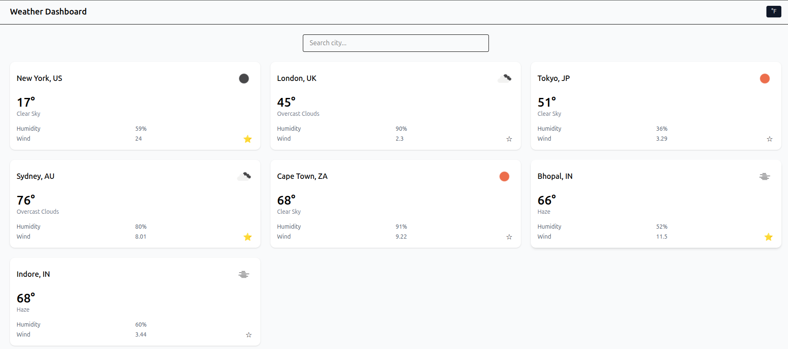
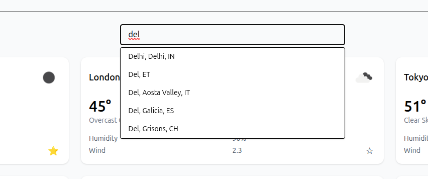
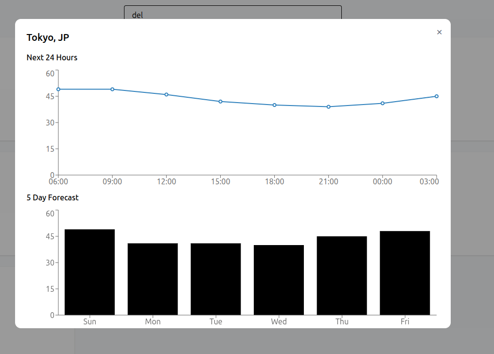

- [Overview](#overview)
  - [The challenge](#the-challenge)
  - [Screenshots](#screenshot)
  - [Links](#links)
  - [Folder Structure](#folder-structure)
- [My process](#my-process)
  - [Built with](#built-with)
  - [What I learned](#what-i-learned)
  - [Useful resources](#useful-resources)
- [Author](#author)
- [Acknowledgments](#acknowledgments)

# Weather Dashboard

## Overview

A modern weather dashboard that allows users to search cities, track favorites, and view real-time current weather and forecasts. The app focuses on clean UI, caching, async state management, and responsive data visualization.

Users can search cities globally, view hourly and 5-day forecasts, and switch between temperature units — all powered by Redux Toolkit and real-time API fetching.

---

## The challenge

The goal of this project was to:

- Build a scalable React architecture
- Handle async API requests with Redux Toolkit
- Implement city search with suggestions
- Cache weather data per city
- Display charts for hourly and daily forecasts
- Avoid duplicate cities
- Manage global UI state cleanly
- Provide smooth loading UX with skeleton cards
- Support responsive layouts

This project focuses on real-world app behavior rather than static UI.

---

## Screenshot





---

## Links

- [Repo URL](https://github.com/ShubhamUday/weather_api.git)
- [Deployed link](https://weatherapi-ashen.vercel.app/)

---

## Folder structure

```
.
└── src
    ├── api
    │   └── openWeather.js
    ├── App.css
    ├── App.jsx
    ├── assets
    │   ├── react.svg
    │   └── screenshots
    ├── components
    │   ├── CityCard.jsx
    │   ├── CityDetailModal.jsx
    │   ├── CityGrid.jsx
    │   ├── CitySearch.jsx
    │   ├── DailyChart.jsx
    │   ├── ErrorState.jsx
    │   ├── Header.jsx
    │   ├── HourlyChart.jsx
    │   └── LoadingCard.jsx
    ├── features
    │   ├── cities
    │   │   ├── citiesSlice.js
    │   │   └── citiesThunk.js
    │   ├── ui
    │   │   └── uiSlice.js
    │   └── weather
    │       ├── weatherSlice.js
    │       └── weatherThunk.js
    ├── index.css
    ├── main.jsx
    ├── pages
    │   └── DashboardPage.jsx
    ├── services
    │   └── weather.js
    └── store
        └── store.js
```

The project is structured using feature-based Redux slices and reusable UI components.

---

## My process

I started by designing the Redux architecture first:

- Cities slice → search + favorites + city list
- Weather slice → cached forecast per city
- UI slice → modal + unit toggle

Then I implemented:

1. City search with async suggestions
2. Weather caching logic
3. Forecast modal with charts
4. Skeleton loading UI
5. Global unit switching
6. Responsive layout

The main focus was clean async flow and normalized Redux state.

---

## Built with

- React
- Redux Toolkit
- React Redux
- Tailwind CSS
- Recharts
- OpenWeather API
- JavaScript (ES6+)

---

## What I learned

- Redux Toolkit async thunk patterns
- Caching API responses
- Normalized Redux state design
- Avoiding unnecessary re-renders
- Skeleton loading UX
- Responsive grid layouts
- Chart data transformation
- Controlled dropdown search UX
- Clean component architecture

This project strengthened my understanding of real-world state management.

---

## Useful resources

- [React Documentation](https://react.dev/)
- [Tailwind CSS Documentation](https://tailwindcss.com/docs)
- [Thinking in React](https://react.dev/learn/thinking-in-react)
- [Redux Documentation](https://react-redux.js.org/introduction/getting-started)
- [Scaler Full Stack Session](https://www.scaler.com/meetings/i/full-stack-lld-projects-javascript-7-events-and-event-handling-3/archive)
- [React Weather App Tutorial](https://www.youtube.com/watch?v=yebyWoRTIMo&t=70s)
- [Redux + Weather Tutorial](https://www.youtube.com/watch?v=BCp_5PoKrvI)

---

## Author

**Shubham Uday**

## Acknowledgments

Special thanks to Ayush sir for guidance and support during development.
